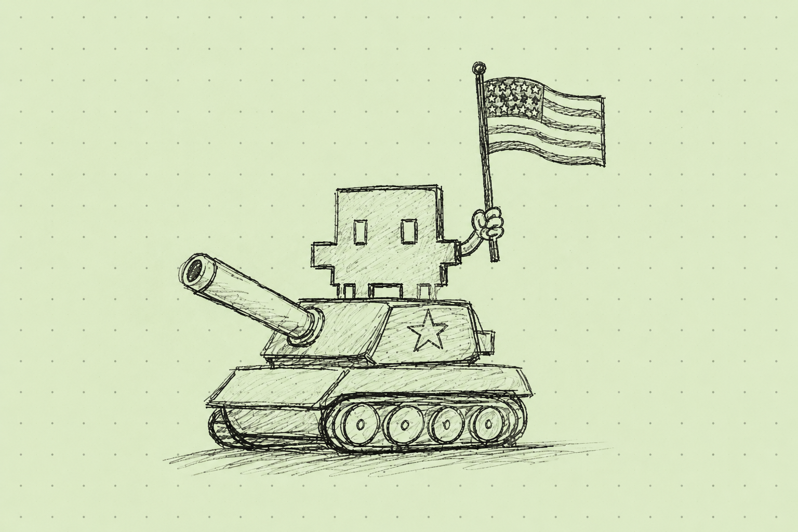

**Obejrzałem ostatnio na YT dokument Bloomberga o niesamowitym sukcesie Anthropica i trochę mnie zmroziło.** 

Firmy Anthropic pewnie nie trzeba nikomu przestawiać, ale dla formalności: to twórcy dużych modeli językowych Claude oraz działającego na ich bazie ekosystemu narzędzi: Claude Code, Claude Cowork i Claude Design. Powstały w 2021 Anthropic jest obecnie wyceniany na ponad 900 miliardów dolarów, co czyni go jedną z najbardziej wartościowych organizacji na świecie.

We wspomnianym dokumencie, Dario Amodei, współłzałożyciel i CEO Anthropica, mierzy się z szeregiem pytań i wątpliwości o etyczne aspekty budowy i wykorzystywania narzędzi opartych o sztuczną inteligencję. Pytania te trafiają na zresztą podatny grunt. W końcu Amodei pozycjonuje Anthropic jako twórcę etycznego AI, działającego w modelu *public benefit corporation* (organizacja, która poza celami czysto biznesowymi, działa na poczet dobra wspólnego). Jego filozofia rozwoju ma stanowić przeciwwagę dla OpenAI, które Amodei opuszczał nie chcąc ponoć zgodzić się na wątpliwe praktyki i standardy bezpieczeństwa wykorzystania modeli językowych. 

Moją uwagę przykuł fragment dokumentu Bloomberga, w którym reporterka pyta właśnie o zasadność i etyczne wątpliwości związane z wykorzystaniem modeli Anthropica w determinowaniu celów ataków USA na Iran w trwającej obecnie wojnie na Bliskim Wschodzie. W wywiadzie pojawia się wręcz sugestia, że mogły one być odpowiedzialne za zbombardowanie szkoły dla dziewcząt w Minabie w lutym 2026, w którego efekcie zginęło ponad 160 osób, głównie dzieci.

O ile Amodei nie odpowiada, czy i w jakim stopniu LLMy Anthropica brały udział tym konkretnym wydarzeniu, to zaznacza, że na pewno nie doszło do złamania kluczowych restrykcji (z tzw. *Red Lines*), jakie organizacja nakłada na podmioty implementujące jej rozwiązania. Te restrykcje sprowadzają się dwóch dobrych praktyk:

1. Braku zgody Anthropica na śledzenie własnych obywateli na masową skalę (*mass domestic surveillance*),
2. Braku zgody Anthropica na wykorzystanie LLMów do operowania w pełni autonomiczną bronią (*fully autonomous weapon*).

### Amodei jest patriotą. Tylko czy to dobrze?

Linia obrony jest więc jasna. Człowiek podejmuje decyzje, nie AI więc człowiek bierze na siebie odpowiedzialność za konsekwencje swoich decyzji. I nawet byłbym w stanie przyjąć ją do wiadomości, gdyby nie to, co usłyszałem chwilę później. 

CEO Anthropic roztacza przed nami swój pogląd na miejsce modeli językowych jego organizacji  w formowaniu światowego porządku. Stwiedza, że wykorzystanie AI w konfliktach zbrojnych stanowi coś na kształt - parafrazuję - nowego wyścigu zbrojeń. A jako, że ostatecznie jest patriorą, to chce, by ci dobrzy, czyli USA, zdobyli przewagę na polu bitwy poprzez uzyskanie dostępu do najnowszych i najsilniejszych rozwiązań. 

Tylko skąd założenie, że Ci dobrzy to USA? 

Czy na pewno reprezentują dobrą stronę w konflikcie z Iranem? W konflickie, który - o ile dobrze pamiętam - jest zwyczjnie nielegalny, bo prowadzony niezgodnie z amerykańską konstytucją (nie został zatwierdzony przez Kongress).  

Patrząc wstecz, czy Stany Zjednoczone na pewno okazały się tymi dobrymi porywając prezydenta Wenezueli i przejmując kontrolę nad złożami ropy w pełni niezależnego państwa?  Bo na pewno nie były etycznie krystaliczne grożąc Danii inwazją na Grenlandię, czy wcześniej - rozpoczynając wojnę w Iraku i Afganistanie w oparciu o sfałszowane dowody. Również wojnę w Wietnamie, czy organizację puczu w Iranie, którego konsekwencją było obalenie demokratycznie wybranego tam rządu, trudno uznać za działania sił dobra. 

Zupełnie nie rozumiem więc argumentacji, w której pojęcie etyki łączy się z patriotyzmem. Gdyby nawet uznać, że łączą się one na poziomie dbałości o kolektywnie wyznawane wartości, zobowiązania i przekonania (np. za etyczne i patriotyczne uznać możnaby krzewienie wolności i demokracji), to trudno uznać ostatnie lata rządów w USA za przykład takiej dbałości. Każdy, kto śledzi sytuację społeczną i polityczną w Stanach i słyszał choćby o aferze gerrymanderingowej, świetnie o tym wie. 

Dlatego moim zdaniem narracja szefa Anthropic w tym aspekcie zupełnie nie trzyma się kupy.

I jasne, zdaje sobie sprawę z kompleksowości realiów w jakich żyjemy. Wiem też, jak infantylnie mogą brzmieć rozterki o etyce w biznesie i geopolityce - zwłaszcza w obliczu destabilizującej się sytuacji międzynarodowej i szalonego wyścigu technologicznego, jakiego jesteśmy świadkami. Ale to nie ja odmieniam słowo etyka przez wszystkie przypadki prowadzą absurdalnie wpływową organizację, a jednocześnie umożliwiam wykorzystanie swojej technologii w nielegalnie prowadzonej wojnie.

PS. Materiały Bloomberga na YT polecam bez zająknięcia. Świetne, pogłębione, nieefekciarskie dziennikarstwo. 

Warto zajrzeć:

- https://youtu.be/v1wZwxY3CMg?si=_8PQG0StWC0XfC1k
- https://www.anthropic.com/news/statement-department-of-war
- https://www.anthropic.com/news/fable-mythos-access
- https://en.wikipedia.org/wiki/Benefit_corporation
- https://pl.wikipedia.org/wiki/Atak_na_szko%C5%82%C4%99_w_Minabie
- https://podcasts.apple.com/pl/podcast/podkast-ameryka%C5%84ski/id1535807947?i=1000768078616
