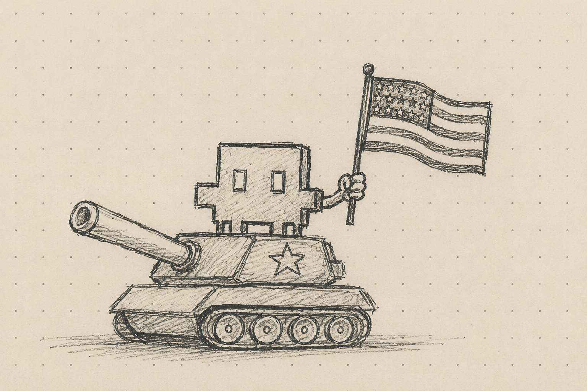

### Obejrzałem ostatnio na YT dokument Bloomberga o firmie Anthropic.

Pewnie nie trzeba jej nikomu przestawiać, ale dla formalności: Anthropic to organizacja, która stoi za dużymi modelami językowymi Claude oraz działającymi na ich bazie: Claude Code, Claude Cowork i Claude Design.

W wywiadzie do tego dokumentu, Dario Amodei, założyciel i CEO Anthropica, odpowiada na pytania autorki o wykorzystanie Claude'a w determinowaniu celów ataków USA na Iran, w tym - w zbombardowaniu szkoły dla dziewcząt w Minabie, w którym to ataku zginęło ponad 160 osób, głównie dzieci.

Amodei nie jest w stanie potwierdzić, czy i w jakim stopniu LLMy Anthropica były w tych działaniach wykorzystywane ale zaznacza, że wykorzystanie ich modeli nie złamało żadnej z tzw "*Red Lines*", czyli kluczowych restrykcji, jakie organizacja nakłada na rządzących chcących korzystać z jej technologii. Te restrykcje to brak zgody na śledzenie własnych obywateli na masową skalę (*mass domestic surveillance*) oraz na wykorzystanie LLMów do operowania w pełni autonomiczną bronią (*fully autonomous weapon*).

Geneza powstania Anthropica i historia jego potyczek z rządem USA jest zresztą powszechnie znana (dla chętnych: link na dole wpisu). Firma pozycjonuje się na rynku jako twórca etycznego AI i działa modelu public benefit corporation.

### Dalsza część wypowiedzi Amodei mocno mnie przeraziła.

CEO Anthropic mówi bowiem, że - tu parafrazuję - ostatecznie jest patriorą i chce, by to jego kraj uzyskał przewagę na polu walki, a wykorzystanie AI w konfliktach zbrojnych jest czymś na kształt nowego konfliktu zbrojeń i wszystkim powinno zależeć, by to ci dobrzy ("the good guys") mieli dostęp do najlepszych rozwiązań.

<<<<[...] Czy na pewno reprezentują tę dobrą stronę w konflikcie z Iranem? Na pewno nie okazali się tymi dobrymi porywając prezydenta Wenezueli i przejmując kontrolę nad złożami ropy w pełni niezależnego państwa. Raczej nie wzbudzili zachwytu partnerów w NATO grożąc Danii przejęciem Grenlandii. Daleko im było do etycznie krystalicznych, gdy organizowali inwazjię na Irak i Afganistan w oparciu o sfałszowane dowody. Podobnie było z wojną w Wietnamie i z organizacją puczu w Iranie, którego konsekwencją było obalenie demokratycznie wybranego tam rządu.

Tylko, czy na pewno USA są krajem krzewiącym te demokratyczne eśli nawet założylibyśmy, że etyka wiąże się z pojęciem narodowości w aspekcie współdzielonych wartości, zobowiązań i przekonań  - choćby takich jak wolność, czy demogracja - to trudno uznać USA za państwo działające w ostatnich latach zgodnie z nimi. [...] >>>>>

Dlatego narracja szefa Anthropic w tym aspekcie zupełnie nie trzyma się kupy.

I jasne, zdaje sobie sprawę z kompleksowości realiów w jakich żyjemy. Wiem też, jak infantylnie mogą brzmieć rozterki o etyce w biznesie i geopolityce - zwłaszcza w obliczu destabilizującej się sytuacji międzynarodowej i szalonego wyścigu technologicznego, jakiego jesteśmy świadkami.

Tylko to nie ja prowadzę wartą 900 miliardów dolarów firmę odmieniając słowo etyka przez wszystkie przypadki, a jednocześnie umożliwiam wykorzystanie swojej technologii w nielegalnie prowadzonej wojnie.

Wspomniane:

- https://youtu.be/v1wZwxY3CMg?si=_8PQG0StWC0XfC1k
- https://www.anthropic.com/news/statement-department-of-war
- https://www.anthropic.com/news/fable-mythos-access
- https://en.wikipedia.org/wiki/Benefit_corporation
- https://pl.wikipedia.org/wiki/Atak_na_szko%C5%82%C4%99_w_Minabie
