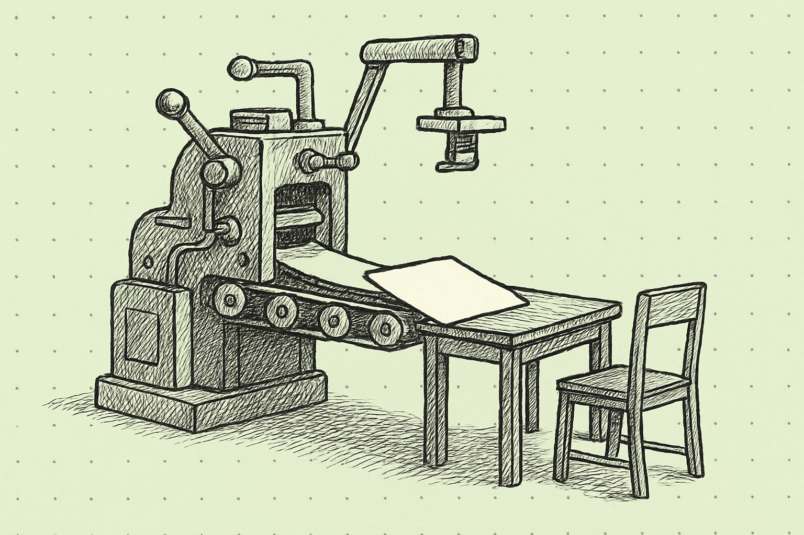
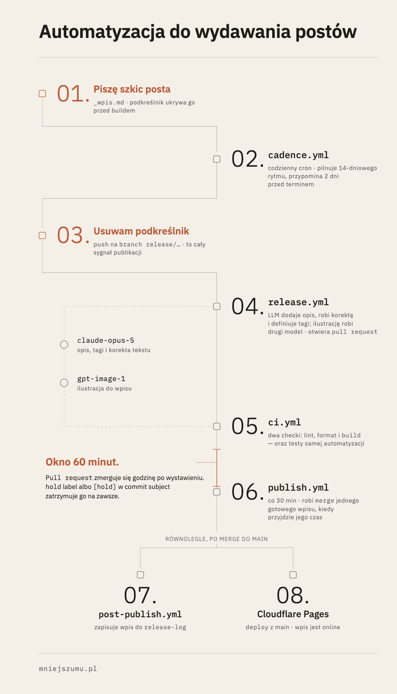
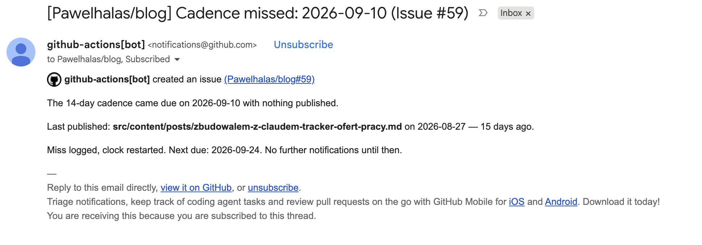

"Skoro buduję stronę, która ma pomóc mi syntetyzować myśli, potrzebuję pozbyć się wszelkich dystraktorów odciągających mnie od pisania." Do takiego wniosku doszedłem po opublikowaniu trzech postów. 

Nie za wcześnie? Pewnie tak! Choć zdawałem sobie w pełni sprawę z faktu, że nie jest to inwestycja konieczna, to uznałem, że spłaci mi się ona bardzo szybko. Oczywiście, mogłem (i może powinienem) postawić *Mniej szumu* na jakimś popularnym CMSie, albo po prostu na Substacku, i tą jedną decyzją pozbyć się problemu na samym początku tej przygody. Uznałem  jednak wówczas, że trochę niedogodności to trochę okazji do testowania i nauki, a wykorzystanie Astro i rozwijanie strony opartej na własnym repozytorium będzie dużo bardziej wartościowym doświadczeniem. 

W każdym razie, zabrałem się za zbudowanie systemu, który ogarnie w moim imieniu wszystko poza faktycznym pisaniem kolejnych postów, czyli:

- przypomni mi o zbliżającym się terminie publikacji,
- ogarnie korektę tekstu,
- zajmie się doborem ilustracji,
- przeprowadzi napisany post przez cały proces wydawniczy.

Świetny plan, prawda? Nie dość, że będę mógł w spokoju skupić się na kluczowych aspektach rozwoju *Mniej szumu*, to jeszcze zaprzęgnę do pracy Claude Code i podszkolę swoje umiejętności vibecodowania.  Wyszło nieźle, ale nie obyło się bez strat. 

### Jak działa automatyzacja? Zależało mi, by zbudować rozwiązanie end-to-end.

Po pierwsze, przypomnienia o terminowych publikacjach. Od systemu dostaję notyfikację mailową, jeśli minęło już 12 dni od ostatniej wydawki, a ja nie mam jeszcze gotowego tekstu w folderze z gotowymi postami. O ile intencjonalnie nie prowadzę predefiniowanego planu wydawniczego, to [obiecałem sobie](https://mniejszumu.pl/posts/i-po-co-to-komu/), że będę wrzucał coś na stronę nie rzadziej niż co 2 tygodnie. Przypominajka o zbliżającym się terminie na pewno mi nie zaszkodzi. 

Do rozpoczęcia procesu wydawniczego, automatyzacja potrzebuje jedynie, bym zasilił folder z contentem gotowym do publikacji plikiem. Plik mogę jednak dodać folderu w każdej chwili i trzymać go tam tak długo, jak chcę - bez obaw o przypadkowy release. Sygnałem o gotowości wpisu do wypuszczenia jest zdjęcie podkreślnika z przedrostka nazwy dokumentu ( _nazwa-pliku.md -->  nazwa-pliku.md).  

Zmiana nazwy pliku jest dla automatu sygnałem gotowości. W ciągu 30 minut od  jego otrzymania, system odpala całe flow publikacji, podczas którego wykonuje robotę, o której ja nie chcę nawet myśleć (bo przecież mam skupić się na pisaniu):

- uderza do Claude Opusa po korektę tekstu, wygenerowanie tagów i opis posta pod SEO.
- uderza do GPT-Image-1, by wygenerować zdjęcie zgodne z uprzednio zdefiniowanymi wytycznymi (tak, wszystkie te niby szkicowane na bullet journalu ilustracje są generowane przez LLM)
- testuje zgodność ostatecznego builda z założeniami i generuje pull request. 
- generuje PR merge'ujący post do main brancha. 

Wygenerowanie przez system PR-u daje mi 60-minutowe okno czasowe na ewentualne powstrzymanie publikacji. Jeśli go nie wykorzystam, automat dodaje wpis w release logu i dokonuje deploymentu posta w Cloudflare. 

### Pracując nad procesem, starałem się pilnować MVP. 

Rozpisałem sobie scenariusze konieczne do pokrycia, ale też trade-offy i listę rzeczy, których w pełni świadomie nie będę budować:

- Scenariusz wstrzymania automatycznego releasu jest i będzie kulawy. Założyłem, że może mi się przydać jakaś furtka do powstrzymania publikacji, ale nie spodziewam się bym kiedykolwiek ją wykorzystał. 
- Przy ewentualnej edycji już opublikowanego posta, integracja z GPT-Image może niepotrzebnie wygenerować nową ilustrację (dodatkowy koszt) i ustawić ją jako nowy hero image. Trudno - nie zamierzam edytować postów. Zamierzam pisać nowe. 
- Mailowe przypomnienie o zbliżającym się terminie realizacji dwutygodniowej kadencji jest de facto wygenerowanym automatycznie issue w Githubie, o którym po prostu dostaję powiadomienie. 

- Nie rozszerzę projektu o budowę automatu do wysyłki newslettera z nowoopublikowanym postem. Póki co, nie zbieram przecież zapisów do newslettera. Może nawet kiedyś będę chciał zacząć i może wówczas taki mechanizm mi się przyda, ale obecnie to raczej pieśń przyszłości. Intruzywne myśli, go away. Mam się skupić na pisaniu.  
- Nie zbuduję nasłuchu na to, czy w Cloudflare deploy poszedł zgodnie z planem. Bez przesady, mogę to sobie szybko sam wyklikać. 

Dzięki tej misternej konstrukcji, całość działa się praktycznie bez mojego udziału! Nie pozostaje nic, tylko pisać posty. 

### Czyli co, sukces? Chyba jednak nie.

Zamiast skupić się na pisaniu, spędziłem czas na budowie automatyzacji, naprawie błędów i łataniu dziur. System jest gotowy, przetestowany, działa pięknie i czeka na treści, które mógłby opublikować.

Gdyby traktować ten projekt jako część PMowej pracy, zabrakłoby tu podstaw: zdefiniowania jego istotności i wpływu na cele projektu na jego obecnym etapie (mam stronę, chcę pisać jak najwięcej - czego potrzebuję?). W tym momencie jest on znikomy, więc pomysł na budowę automatyzacji zapewne trafić na dno backlogu i czekać na swoją kolej. 

Na szczęście, ten projekt to zabawa, więc robię w jego ramach dokładnie to, co chcę. A chcę przecież pisać i syntetyzować myśli.

Oh wait...

