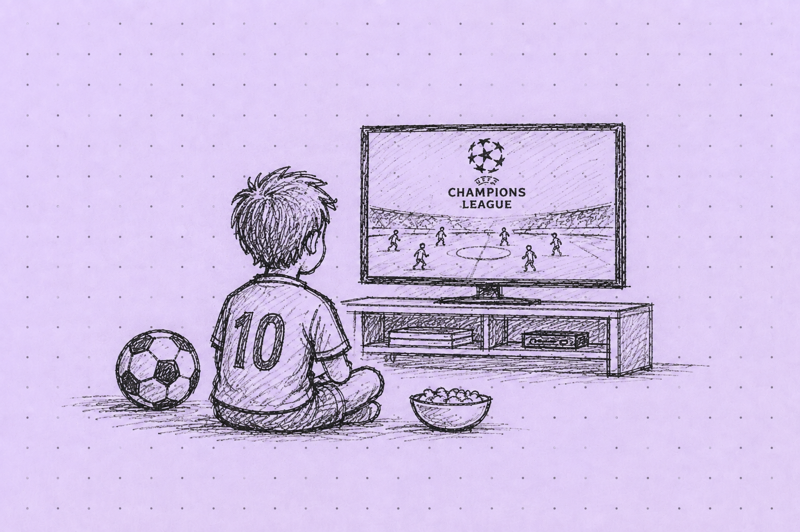

**Nie wiem, czy pisanie kiedykolwiek sprawiało mi wielką przyjemność, ale na pewno przychodziło mi łatwo.**

Pamiętam, że wypracowania na język polski w liceum cisnąłem w środy późnymi wieczorami. Dwudziesta trzecia, mecz Ligi Mistrzów obejrzany, wszystkie skróty też. Można zabierać się do zadania domowego. Wystarczała godzina w skupieniu i miałem zabazgrane cztery strony A4. Zwarta struktura, porównania, alegorie, odniesienia do tekstów kultury. Voila!

Kolejna godzina bądź dwie i miałem gotową recenzję jakiejś płyty albo filmu. Wysyłałem je do różnych internetowych redakcji i - w zamian za publikację - dostawałem płyty CD albo DVD. Easy money!

Pisać przestałem na studiach... dziennikarskich.

Poszedłem na nie z przekonaniem, że zostanę nowym Tomaszem Lisem albo Kubą Wojewódzkim. Wiem, jak cringe'owo to dziś brzmi, ale kiedyś to była topka polskiego dziennikarstwa. Po roku i kilku przygodach w lokalnych redakcjach zrozumiałem, że to zupełnie nie moja bajka.

Teraz, po kilkunastu latach, postanowiłem wrócić do pisania. I wracam z kilku konkretnych powodów.

Po pierwsze, szukam narzędzia, które pomoże mi efektywniej zbierać myśli i sprawniej układać je w logiczne struktury. Odkąd pamiętam, syntetyzowanie informacji w czytelną, klarowną komunikację było moją mocną stroną. A ostatnio mam wrażenie, że coraz częściej zwyczajnie bełkoczę. W "Thinking, Fast and Slow" Daniel Kahneman pisał, że koherentna i logiczna wypowiedź wymaga wysiłku poznawczego oraz zaangażowania tzw. Systemu 2 (myślenia wolnego), który kontroluje i weryfikuje fakty.

Chciałbym trochę częściej myśleć trochę wolniej.

Po drugie, potrzebuję miejsca, w którym będę mógł stawić opór otaczającemu mnie szumowi komunikacyjnemu i AI slopowi. Nie zrozummy się źle, korzystam z AI-owych narzędzi chętnie i często. Coraz częściej. Zresztą, o swoich przygodach z Claude Code czy Lovable, będę tu na pewno od czasu do czasu wspominał. Ale właśnie dzięki interakcji z narzędziami AI zauważam, jak szybko i radykalnie zmienia się mój sposób tworzenia i konsumpcji treści. Chciałbym znaleźć dla niego przeciwwagę.  

Zresztą, wydaje mi się też, że własne, unikalne, niezaśmiecone przez interakcję z AI treści będą niedługo na wagę złota. Dlatego zamierzam zainwestować w ich tworzenie trochę swojego czasu. Może nie jest to prognoza na miarę słynnego "water betu" Michaela Burry'ego, ale na moje potrzeby wystarczy. 

Po trzecie w końcu, w następstwie małych zawodowych zawirowań (o których kiedyś pewnie napiszę), mam teraz trochę więcej czasu. Jako że zawodowo jestem związany z branżą IT i budowaniem produktów cyfrowych, mocno nosi mnie, by wypchnąć coś na produkcję. Mniej szumu wypuszczam więc też z myślą o zapisywaniu obserwacji ze świata technologii i product managementu oraz o zbieraniu notatek i wniosków z własnych przygód w prototypowaniu, walidacji pomysłów oraz wyciągania informacji o problemach, które warto rozwiązywać.

O czym więc dokładnie będzie ta strona, dopiero się okaże. Obiecałem sobie przy okazji spisywania założeń tworzenia Mniej szumu, że nic, co opublikuję, nie powstanie z wykorzystaniem AI. Nie ma być idealnie - ma być po mojemu. Drugim oczekiwaniem, jakie sam przed sobą stawiam, jest konkretna wydawnicza kadencja. Nowe wpisy powinny pojawiać się nie rzadziej niż raz na dwa tygodnie.

Wszystko inne wyjdzie w praniu. 
