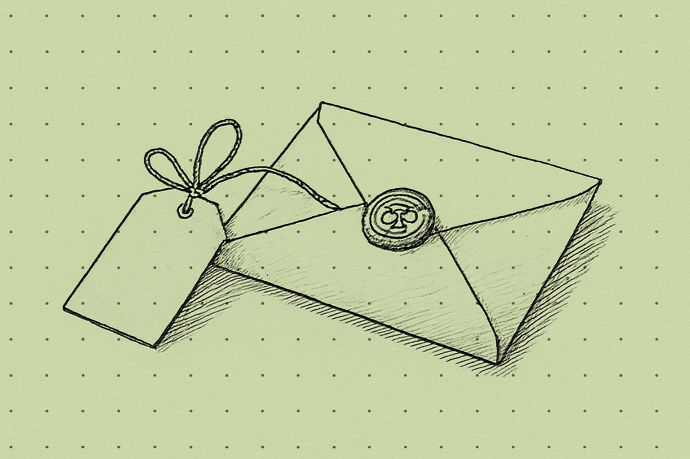

Post testowy, druga próba. Sprawdzamy blokadę publikacji i harmonogram. Zostanie usunięty zaraz po sprawdzeniu.

Pierwsza próba wykazała, że blokada nie działała, bo potok dokładał własny commit na wierzchu. Teraz znacznik ustawia etykietę i to etykieta decyduje.

Jeżeli widzisz ten tekst na żywej stronie dłużej niż kilka minut, sprzątanie się nie powiodło.
