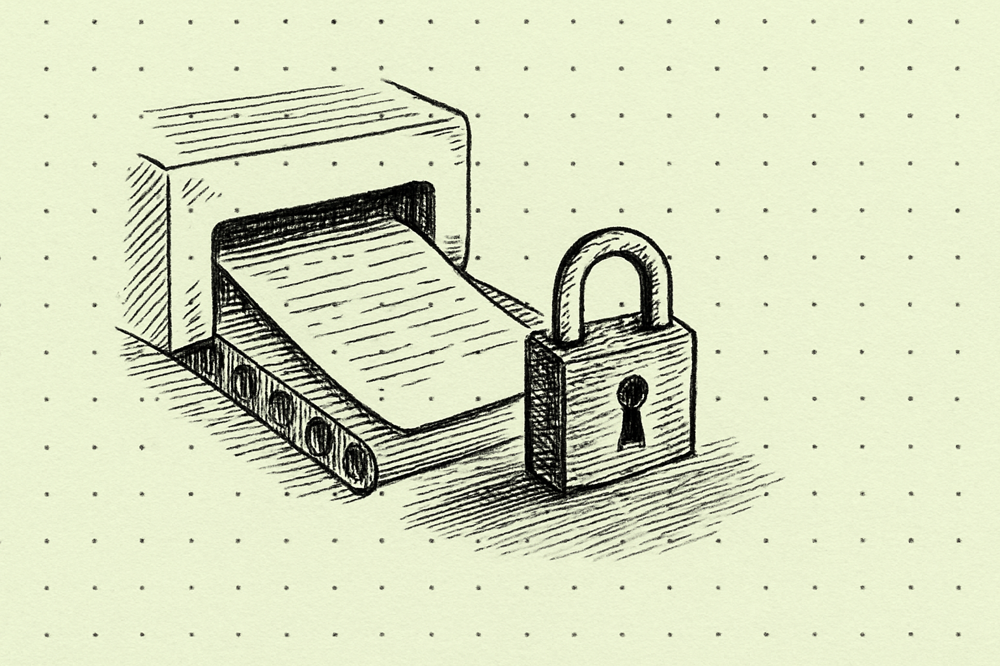

To jest post testowy. Powstał po to, żeby sprawdzić, czy cała ścieżka publikacji działa bez udziału człowieka, i zostanie usunięty zaraz po tym sprawdzeniu.

Sprawdzamy trzy rzeczy. Po pierwsze, czy potok przygotuje metadane i obrazek. Po drugie, czy publikacja zatrzyma się, kiedy poprosimy ją o wstrzymanie. Po trzecie, czy po zdjęciu blokady post opublikuje się sam.

Jeżeli czytasz to na żywej stronie dłużej niż kilka minut, to znaczy, że sprzątanie po próbie się nie powiodło.
