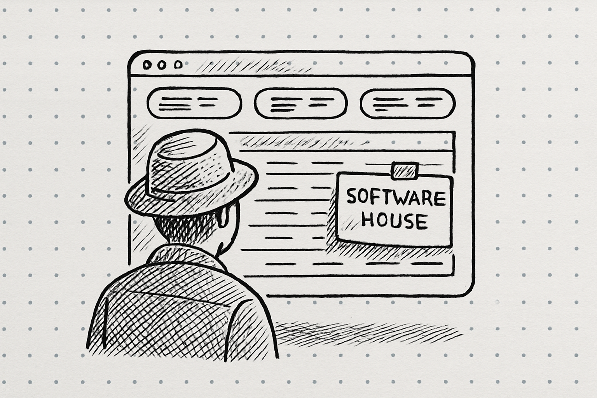
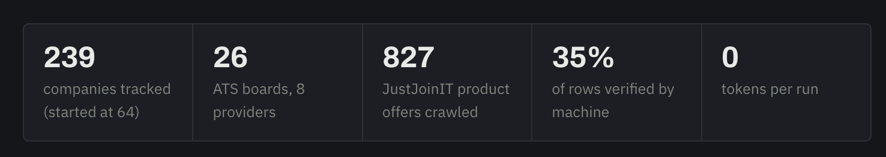
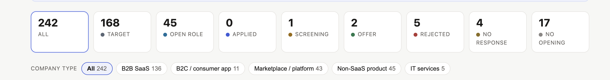

Jakoś pod koniec lipca zacząłem rozglądać się za nową pracą. W pierwszym kroku, spisałem w miarę dokładnie, czego i kogo szukam:

- *profil organizacji:* startup lub scale-up IT (nie więcej niż 200-300 osób, najchętniej mniej niż 100) z Polski lub UE; własny produkt, działający w modelu B2B; mało biurokracji, focus na działanie a nie self-branding.  
- *profil stanowiska*: product management. Orientacja na budowanie i iteracyjną optymalizację produktu z dużym wpływem na biznes, a nie na pilnowanie backlogu. Team leadership i people management opcjonalny, ale absolutnie niekonieczny (prowadzę zespoły w różnych konfiguracjach od 13 lat, ale nigdy nie szukałem stanowisk liderskich - one po prostu zawsze jakoś do mnie trafiały).

Mając zebrane oczekiwania, postanowiłem zautomatyzować proces poszukiwań z Claudem - budując tracker ofert pracy. Projekt zakładał 2 etapy:

1. Research rynku firm, w których chciałbym pracować. 
2. Research ofert pracy w tych firmach. 

Pierwszy etap poszedł dość sprawnie:

- Odpaliłem projekt w Cowork'u, określiłem profil firm, w których pracy szukam.
- Wykorzystałem mały reverse-engineering, promptując do Claude'a z prośbą o zebranie ode mnie informacji o poszukiwanych organizacjach tak, by wyszukiwanie było jak najlepszej jakości. Wokół tego mechanizmu buduję sporo skilli i zazwyczaj działają one naprawdę dobrze.
- Z początkowej grupy ~70 firm, powstała ostatecznie baza 239 organizacji. 
- Mojemu idealnemu profilowi w pełni odpowiadało około 40-50 z nich, ale postanowiłem, że tracker będzie pracował na pełnej bazie. Nie wiedziałem w końcu, czy nie będę musiał trochę zrewidować swoich wyobrażeń, albo rozszerzyć zakresu poszukiwań na pracodawców lub stanowiska, na które pierwotnie nie planowałem aplikować.  

Gdy baza firm była już gotowa, zabrałem się za budowę trackera ofert. Jego założenia były dość proste:  

- w każdy poniedziałek o 21:00 Claude miał odpalać *weekly check* - zaplanowane uprzednio zadanie przeszukania bazy firm w poszukiwaniu pasujących mi ofert pracy. 

- godzinę przed odpaleniem się crawlera, miałem dostawać od Claude'a przypomnienie o zaktualizowaniu informacji z mijającego tygodnia. Jeśli w trakcie trwania tygodnia manualnie naniosłem jakieś zmiany w trackerze, miałem wyeksportować dane i przekazać je w czacie w postaci zwykłego pliku JSON. Przekazane przeze mnie zmiany miały być uwzględnione w realizacji cyklicznego crawlingu. 

- Tracker miał przeszukiwać internet w poszukiwaniu ofert w oparciu o 3 założenia:

  - Sprawdzać feed ośmiu ATSów (Greenhouse, Lever, Ashby, Workable, Smartrecruiters, Recruitee, Personio, Teamtailor) w poszukiwaniu ofert ze zdefiniowanej grupy organizacji. Okazało się to możliwe, gdyż produkty do zarządzania procesami rekrutacji udostępniają publiczne endpointy, w oparciu o które organizacje mogą renderować na swoich stronach karier aktualne ogłoszenia. Nie ma w związku z tym potrzeby żadnego uwierzytelnienia, ani rate-limitów (*poza Personio). ATSy traktują otwarte API jako udokumentowaną funkcję, a nie lukę w działaniu produktów. 
  - Szukać nowych ogłoszeń na JustJoin.it.  JJIT okazało się single-page aplikacją, więc to co widzimy w przeglądarce to "skorupa" apki właśnie + dane pochodzące z `api.justjoin.it/v2/user-panel/offers`  - z ofertami dostępnymi publicznie i renderowanymi w przeglądarce (nie jest to jednak udokumentowana metoda i - gdy sprawdziłem ją ponownie w dniu publikacji tego posta - dostałem zwrot `503`, co sugeruje, że może być ona już niedostępna). 
  - Jeśli w którymś z tych miejsc (ATSy, JJIT) tracker znajdzie oferty z firm, których uprzednio nie dodałem do swojej listy, a okażą się one a spełniać moje oczekiwania, to powinien rozszerzyć o nie swoją bazę organizacji. 

  Jeśli ofert wybranych firm nie napotkałem ani w listingach ATSów ani na JustJoin.it, musiałem sprawdzać ich strony karier manualnie. Nie znalazłem do nich drogi na skróty, a nie zdecydowałem się na rozszerzenie trackera o crawlowanie stron każdej z firm z osobna. Koszty takiej operacji byłyby zbyt duże, a sam proces - zbyt czasochłonny.

  

  ### Ostatecznie, automatyzacja uzyskała dostęp do ofert z ok. 80 spośród 240 firm, które miałem w bazie. 

  Zapewne jest to wynik bez szału, ale w gronie tych 80 organizacji było wiele z spośród firm pasujących do mojego profilu idealnego pracodawcy. Tracker łącznie odpalił się 4-krotnie i wykrył mi ok. 50 wysoce pasujących ofert. Prezentował mi je w postaci pliku HTML, który odpalałem sobie w przeglądarce i w którym mogłem:

  - zarządzać statusami moich aplikacji,
  - przeklikać się przez oferty,
  - dodać notatki do poszczególnych zgłoszeń,
  - filtrować i sortować po kategoriach i subkategoriach - firm, samych ofert i dopasowaniu do moich wstępnych wytycznych. 

  Poza HTMLowym artefaktem, Claude niestety postanowił wypluwać też szereg dokumentów, o które nie prosiłem:

  - up-to-date-tracker (plik z aktualnymi ofertami),
  - weekly-digest (plik z podsumowaniem wydarzeń mijającego tygodnia - co zrobił claude i co w międzyczasie zrobiłem ja),
  - new-companies-discovery-list
  - ats-snapshot.json
  - up-to-date-backup-file.

Może ich wygenerowanie nie kosztowało mnie szczególnie dużo, ale wciąż były to dokumenty w dużej mierze zbędne.  

### W toku swoich poszukiwań wysłałem łącznie 12 zgłoszeń.

- Cztery z nich odrzucono niemal natychmiast - prawdopodobnie z automatu, na pewno bez kontaktu ze mną. 
- Jedno odrzucono po ok. 3 tygodniach ciszy, ale nie był to automat - odezwał się do mnie rekruter. 
- Trzykrotnie zostałem bezczelnie zghostowany. Słabo. 
- Wskoczyłem w 3 procesy.
- Dostałem dwie oferty pracy. 
- Przyjąłem jedną. 

### I tu powinienem odpalić clickbaitowy header: *Napisałem z AI tak świetny tracker, że to praca znalazła mnie, a nie ja ją.*  

Niestety, nic z tego. Nie będzie highlightów na instagramowe reelsy, ani AI-generowanych infografiki do postów na Linkedinie. Tracker wykrył i intencjonalnie ukrył przede mną ogłoszenie, które ostatecznie zamieniło się w przyjętą przeze mnie ofertę pracy. 

Dlaczego? Bo w założeniach zbudowanego narzędzia nie uwzględniłem kilku niuansów, o których wystąpieniu Claude też mnie nie ostrzegł. A może ostrzegł, ale ja tego ostrzeżenia nie wyłapałem. 

Przede wszystkim, organizacja do której dołączam została w pierwotnym researchu uznana za software house i nie trafiła do grona firm, do których miałem się zgłaszać. A chciałem, by tracker pomijał oferty z software house'ów, w których nigdy nie pracowałem i o specyfice działania których wiem niewiele. Nie było więc w moim automacie samej organizacji, ale tracker mógł i powinien dotrzeć do  oferty, gdyby uznał ją za pasującą do moich założeń. Ogłoszenie opublikowano na JJIT, a ja uwzględniłem przecież w mechanizmie zarówno crawling w poszukiwaniu nowych publikacji, jak i o rozszerzanie listy firm o nowe, jeśli  ich oferty będą pasowały choćby częściowo odpowiadały moim opisom.

I wszystko zadziałało zgodnie z planem. Operacja się udała, tylko pacjent zmarł. 

Oferta została pierwotnie przez tracker wyłapana, a następnie - ukryta. Problem polegał na tym, że automat nie wykrył nowej oferty od nieznanej mi firmy, ale odpowiadające mi ogłoszenie od organizacji uznanej za software house. 

A skoro do software house'u Paweł nie chce, to oferty z software house'u Paweł nie zobaczy. 

W ten sposób, do trackera nie dotarło łącznie 20 ofert z JJIT, które dotrzeć powinny. Nie uzbroiwszy Claude'a w instrukcję, by wątpliwości weryfikował ze mną, pozwoliłem na to, by mechanizm wykrywał oferty w 100% mi odpowiadające, a następnie podejmował samodzielną decyzję o ich ukryciu. Gdyby JustJoinIT nie wysłał mi mailowych rekomendacji, pewnie nigdy bym na tę zwycięską ofertę nie trafił.

Kudos dla Was, JJIT! Macie lepsze profilowanie ode mnie!  

### Wnioski z budowy trackera.

1. Po pierwsze, praca z narzędziami AI nie zwalnia Cię z myślenia i nie zacznie myśleć za Ciebie. 

   Może trywialne, ale prawdziwe. Wiele mówi się o tym, że AI działa jak pojętny stażysta - ogarnie wszystko, czego będziesz od niego wymagać, ale jakość jego pracy będzie zależała od jakości Twojej komunikacji. W przypadku mojego trackera, ten scenariusz potwierdził się w 100%. Zwyczajnie nie przyszedł mi do głowy niuans rozróżnienia profilu produktu, czy marki od profilu firmy ten produkt budującej. Nie uwzględniłem też w *guardrailsach* weryfikacji wątpliwości ze mną. 

   

2. Po drugie, kontrola outputu - jego formatu, skali, sposobu prezentacji treści - jest kluczowa w efektywnej pracy z dużymi modelami językowymi. Im szybciej i konkretniej określisz, jakiego efektu z tej współpracy oczekujesz, tym lepiej dla Ciebie. 

   Ja już przy drugiej rundzie działania trackera natrafiłem na przytłaczającą ścianę tekstu i kilka dodatkowych dokumentów z jego aktywności, o których wcześniej wspomniałem. Może realnie nigdy o nie nie prosiłem, ale też niewystarczająco dokładnie określiłem czego chcę, a czego absolutnie w ramach tego projektu nie potrzebuję. W efekcie, wyciągnięcie kluczowych znalezisk trackera w danym tygodniu wcale nie było takie proste. Dopiero trzecia iteracja zwróciła zadowalający mnie format. 

Zresztą, o optymalizacji formatu informacji zwrotnej napiszę więcej za jakiś czas, sprzedając trochę informacji z prac nad produktem, który buduję własnymi siłami, w ramach zabawy w vibecoding. 

### Luźne spostrzeżenia z poszukiwań pracy A.D. 2026

Moja przygoda na rynku pracy nie trwała może zbyt długo, więc nie śmiałbym wyciągać na jej podstawie jakichś daleko idących wniosków. Zresztą, trafiłem na tenże rynek po raz pierwszy od 10 lat. Co ja mogę o nim realnie wiedzieć? Nic! 

Ale mam kilka luźnych obserwacji ze swojego udziału w procesach rekrutacyjnych i kilka wniosków do zapisania na przyszłość: 

1. Hurtowe wysyłanie setek CV nie ma sensu, jeśli nie wiesz do jakich firm je wysyłasz i w zasadzie nie chcesz się tego dowiedzieć. 

   Zastanawiałem się. czy nie pchnąć swojej automatyzacji o krok dalej i nie oddać Claude'owi kontroli nad wysyłką moich aplikacji. Ztwierdziłem jednak, że to o krok za daleko - sam wybiorę, gdzie chcę aplikować. 

   Każdy z trzech procesów w którym brałem udział zaczynał się od screeningu, podczas którego rekruter upewniał się, że mam podstawową wiedzę o firmie, do której aplikowałem i faktycznie interesuję się podjęciem pracy w roli, na którą trwa rekrutacja. Raz nawet zapytałem z czego wynika ta weryfikacja i usłyszałem, że coraz częściej kandydaci nieumiejętnie korzystają z możliwości aplikowania jednym kliknięciem (przez Linkedin czy JJIT) i w efekcie nie mają nawet pojęcia w jakich procesach biorą udział. 
   Screening odsiewa takich gagatków w pierwszej kolejności. A ja stałbym się takim gagatkiem, gdybym dobudował do trackera mechanizm aplikowania w moim imieniu. 

2. Linkedin to rak, z którego jednak trudno zrezygnować, jeśli rozglądasz się za nową pracą. 

   Zamierzam napisać osobny post na temat Linkedina i swoich obserwacji i doświadczeń z nim związanych. Wrzucę do niego link, gdy już będzie gotowy. 

3. ATSy są bezlitosne. 

   Kilka odrzuconych zgłoszeń to był ewidentny automat. Dostałem po prostu generyczną odpowiedź z podziękowaniami za udział w procesie i informacją, że nie zaproszą mnie na kolejny etap. Może to kwestia konkretnych keywordów (albo ich braku) w CV, może wieku, może profilu doświadczenia. Trudno powiedzieć. 
   A może też automatyzacja analizy zgłoszeń ma coś wspólnego z punktem pierwszym mojej wyliczanki - łatwością wysyłania aplikacji. Działy HR mogą być dosłownie zasypane setkami, jeśli nie tysiącami CV na każdą z opublikowanych ofert i muszą posiłkować się automatami, by jakoś nimi zarządzić.  
   
4. Poznanie organizacji to jedno; przygotowanie się do procesu, to zupełnie coś innego. 

   Na pierwszą rozmowę w sprawie pracy (z rekomendacji, nie z własnych poszukiwań) poszedłem na początku czerwca, chwilę po zakończeniu współpracy z poprzednią firmą. Wiedziałem świetnie, do jakiej organizacji uderzam, ale nie byłem gotowy, by dobrze się zaprezentować. Nie wiedziałem, jakich pytań mogę się spodziewać, więc nie miałem pojęcia, czy i jak na nie odpowiem. Wiem, jakie pytania sam bym zadawał, ale przecież tym razem to nie ja rekrutowałem, a byłem rekrutowany. 
   W każdym razie, to było dość brutalne doświadczenie. Może nie wypadłem jakoś fatalnie, ale zwyczajnie czułem, że momentami bełkoczę.

   Oczywiście, nie dostałem tamtej roboty. I słusznie, nie powinienem jej dostać. Nauka nie poszła jednak w las. Na kolejne rozmowy byłem już przygotowany.  

   

   Warto rzucić okiem: 

   https://cavuno.com/blog/ats-platforms-public-job-posting-apis

